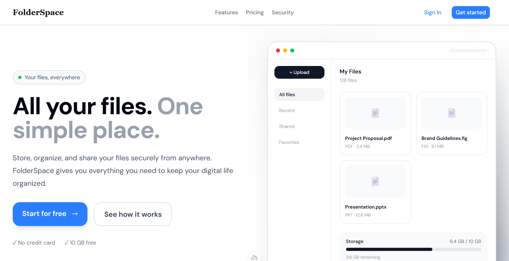
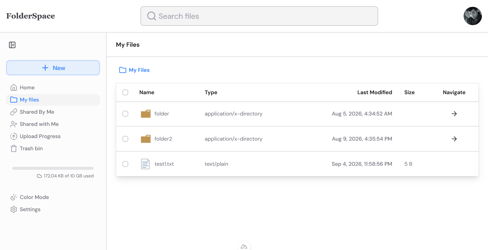
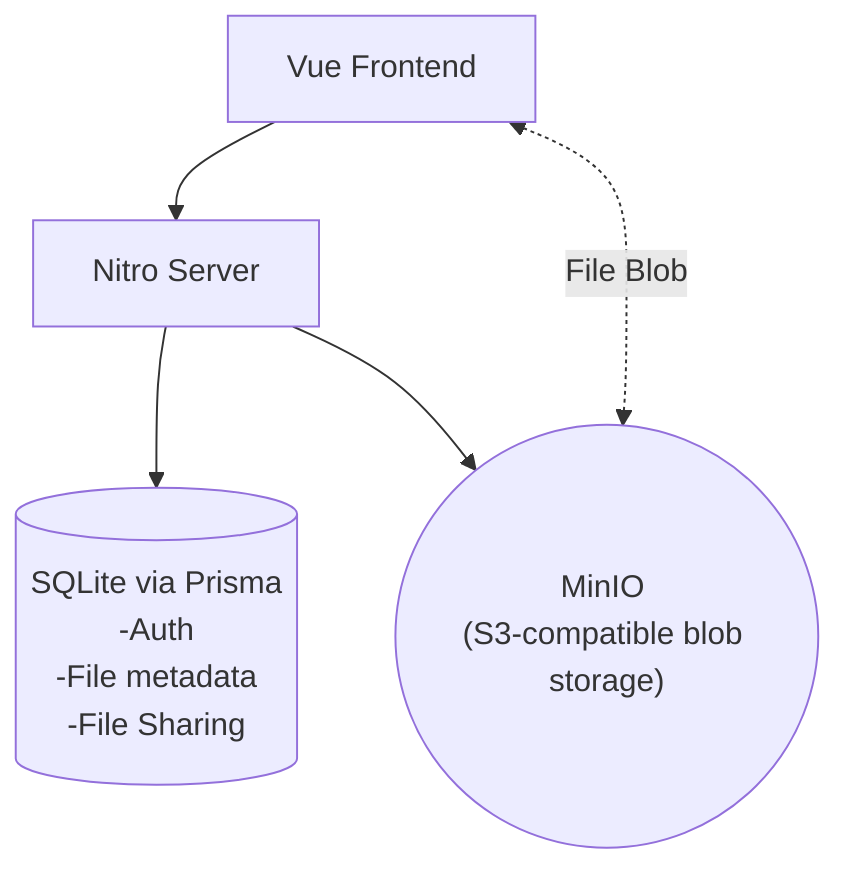

# Nuxt Cloud Storage Clone




A local-only, self-hosted Dropbox/Google Drive clone built to learn the core
system-design ideas behind cloud file storage, including chunked/resumable uploads,
presigned object storage, folder trees, sharing, and real-time-ish sync.

Loosely based on the system design breakdown at
[hellointerview.com/learn/system-design/problem-breakdowns/dropbox](https://www.hellointerview.com/learn/system-design/problem-breakdowns/dropbox),
scaled down to run entirely on one machine.

> **Status**: actively being built. Not deployed, not intended to be.

## What this is for

This project exists to practice the real mechanics of a file-storage product. It's
not a UI clone, but the actual protocols: multipart/chunked upload with
pause/resume/cancel, presigned-URL object storage, owner/share access control,
and a folder tree with move/rename/trash It uses tools you'd reasonably see in
a real stack, just pointed at `localhost` instead of the cloud.

## Tech stack

| Layer          | Choice                                                    | Why                                                                                                                            |
| -------------- | --------------------------------------------------------- | ------------------------------------------------------------------------------------------------------------------------------ |
| Framework      | Nuxt 4 (Nitro server routes + Vue frontend)               | Full-stack in one codebase, no separate backend needed for this scale                                                          |
| Database       | SQLite via Prisma 7                                       | Zero-setup, file-based, fine for single-user local use                                                                         |
| Object storage | MinIO (Docker)                                            | S3-API-compatible. The real `@aws-sdk/client-s3` and presigned-URL flow work unmodified against it                             |
| Auth           | `nuxt-auth-utils`                                         | Session management with Cookie.                                                                                                |
| UI             | Nuxt UI v4                                                | Component library built by the Nuxt team, Tailwind-based                                                                       |
| State          | Vue reactivity + Pinia (for the global upload queue only) | Most state is page-local via `useFetch`; Pinia is reserved for state that genuinely outlives a single page (in-flight uploads) |
| Validation     | Zod                                                       | Shared schemas between client and server                                                                                       |

## Architecture at a glance



The server never proxies file bytes. Uploads and downloads go directly
between the browser and MinIO using short-lived presigned URLs; Nitro's job
is issuing those URLs, tracking metadata, and enforcing access control.

## Local setup

### Prerequisites

- Node.js, pnpm
- Docker (for MinIO)

### 1. Start MinIO

```bash
docker compose up -d
```

This starts MinIO (S3 API on `:9000`, web console on `:9001`) and
auto-creates the storage bucket via an `mc` sidecar container.

### 2. Configure environment

Create a `.env` file and copy-paste [`.env.example`](./.env.example) values (defaults work out of the box
for local dev):

### 3. Install dependencies and set up the database

```bash
pnpm install
pnpm prisma migrate dev
```

### 4. Run the app

```bash
pnpm dev
```

## Features

### Files & folders

- Upload, download, rename, move (drag-and-drop or "Move to…" dialog with a
  folder-tree picker).
- Folder nesting, breadcrumb navigation.
- Soft-delete (trash) → restore → permanent delete.
- Multi-select (click, Ctrl/Cmd-click, Shift-click range-select), right-click
  context menu that operates on the full selection.
- Content-based deduplication via SHA-256 fingerprint. Re-uploading
  identical content reuses the existing object instead of re-uploading.

### Uploads

- Small files: single presigned `PUT`.
- Large files: automatically routed to **chunked/multipart upload**
  (server decides the threshold, not the client). Real S3 multipart
  protocol against MinIO, with per-chunk presigned URLs and ETag verification.
- Pause / resume / cancel, with live byte-level progress.
- A persistent upload queue (Pinia) that survives navigation, with a
  server-backed status endpoint so an in-progress upload is still visible
  after a page refresh.

### Sharing

- **Per-person sharing** by email, with or without an existing account
  View or edit permission.
- **Link sharing**, separate from per-person shares:
  optional password, optional expiration, revocable, and usable by anonymous
  visitors with no account at all.
- A shared folder renders as its own scoped mini file-browser — breadcrumbs,
  download, and folder navigation all re-validate the link (and its
  password/expiry/revocation) on every request, and are structurally
  prevented from ever navigating above the folder that was actually shared

## Project structure

```
app/                      # Nuxt app (pages, components, composables)
server/
  api/                    # Nitro API routes
  utils/                  # Prisma client, S3 client, shared server helpers
prisma/
  schema.prisma           # File, FileChunk, User, Share, ShareLink models
shared/
  schemas/                # Zod schemas (shared between client & server)
  types/response/         # Shared response types
docker-compose.yml        # MinIO
```

## Deliberate scope cuts

Things left out on purpose, since this isn't meant to be production-grade:

- No CDN, no multi-region, no horizontal scaling. Single machine only.
- No email delivery for share invites (pending shares surface in-app instead).
- Folders can only be deleted when empty. No recursive delete yet.
- No scheduled cleanup job for abandoned/orphaned in-progress uploads yet.
- No real storage quota enforcement. Show a fixed display-only number.

## Known gaps / next up

- Orphaned `UPLOADING` row cleanup (crashed/abandoned uploads leave stale rows).
- Recursive folder delete.
- Non-chunked upload cancel cleanup for already-uploaded-but-abandoned objects.
- File searching.

# License

MIT
